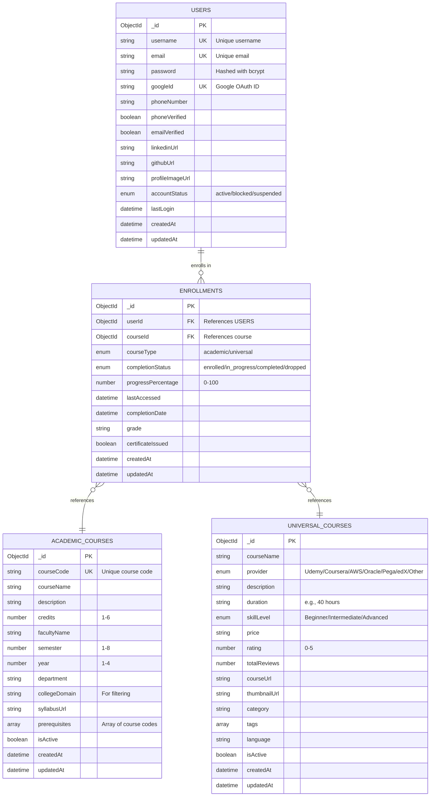

# Entity-Relationship Diagram (Mermaid Format)

## How to View
Paste this code into:
- GitHub markdown file
- Mermaid Live Editor: https://mermaid.live
- Any markdown viewer that supports Mermaid

---

## ER Diagram Code



---

## Relationships Explanation

### 1. USERS to ENROLLMENTS (One-to-Many)
- **Cardinality:** 1:N
- **Description:** One user can enroll in multiple courses
- **Foreign Key:** ENROLLMENTS.userId references USERS._id
- **Constraint:** CASCADE on delete (when user is deleted, their enrollments are also deleted)

### 2. ACADEMIC_COURSES to ENROLLMENTS (One-to-Many)
- **Cardinality:** 1:N
- **Description:** One academic course can have multiple student enrollments
- **Foreign Key:** ENROLLMENTS.courseId references ACADEMIC_COURSES._id
- **Constraint:** RESTRICT on delete (cannot delete course if enrollments exist)
- **Condition:** When ENROLLMENTS.courseType = 'academic'

### 3. UNIVERSAL_COURSES to ENROLLMENTS (One-to-Many)
- **Cardinality:** 1:N
- **Description:** One universal course can have multiple student enrollments
- **Foreign Key:** ENROLLMENTS.courseId references UNIVERSAL_COURSES._id
- **Constraint:** RESTRICT on delete (cannot delete course if enrollments exist)
- **Condition:** When ENROLLMENTS.courseType = 'universal'

---

## Database Schema Diagram (Chen Notation)

```
┌─────────────┐
│    USERS    │
│             │
│  _id (PK)   │
│  username   │
│  email      │
│  password   │
└──────┬──────┘
       │
       │ 1
       │
       │ enrolls in
       │
       │ N
       ▼
┌─────────────────┐
│  ENROLLMENTS    │
│                 │
│  _id (PK)       │
│  userId (FK)◄───┘
│  courseId (FK)──┐
│  courseType     │
│  progress%      │
└─────────────────┘
                  │
          ┌───────┴───────┐
          │               │
          │ N             │ N
          │               │
      references      references
          │               │
          │ 1             │ 1
          ▼               ▼
┌──────────────────┐  ┌───────────────────┐
│ ACADEMIC_COURSES │  │ UNIVERSAL_COURSES │
│                  │  │                   │
│  _id (PK)        │  │  _id (PK)         │
│  courseCode      │  │  courseName       │
│  courseName      │  │  provider         │
│  credits         │  │  skillLevel       │
│  semester        │  │  rating           │
└──────────────────┘  └───────────────────┘
```

---

## Cardinality Summary

| Relationship | Type | Description |
|--------------|------|-------------|
| User → Enrollment | 1:N | One user can have many enrollments |
| Academic Course → Enrollment | 1:N | One course can have many enrollments |
| Universal Course → Enrollment | 1:N | One course can have many enrollments |
| Enrollment → User | N:1 | Many enrollments belong to one user |
| Enrollment → Course | N:1 | Many enrollments reference one course |

---

## Index Strategy

### Users Collection
```javascript
// Unique indexes for authentication
db.users.createIndex({ email: 1 }, { unique: true })
db.users.createIndex({ username: 1 }, { unique: true })
db.users.createIndex({ googleId: 1 }, { unique: true, sparse: true })
```

### Academic Courses Collection
```javascript
// Unique course code
db.academic_courses.createIndex({ courseCode: 1 }, { unique: true })

// Query optimization
db.academic_courses.createIndex({ semester: 1 })
db.academic_courses.createIndex({ collegeDomain: 1 })
db.academic_courses.createIndex({ isActive: 1 })
```

### Universal Courses Collection
```javascript
// Query optimization
db.universal_courses.createIndex({ provider: 1 })
db.universal_courses.createIndex({ skillLevel: 1 })
db.universal_courses.createIndex({ category: 1 })
db.universal_courses.createIndex({ rating: -1 })
```

### Enrollments Collection
```javascript
// Foreign key indexes
db.enrollments.createIndex({ userId: 1 })
db.enrollments.createIndex({ courseId: 1 })

// Prevent duplicate enrollments
db.enrollments.createIndex(
  { userId: 1, courseId: 1, courseType: 1 }, 
  { unique: true }
)

// Query optimization
db.enrollments.createIndex({ completionStatus: 1 })
```

---

## Data Flow Diagram

```
┌─────────────┐
│   Student   │
│   (User)    │
└──────┬──────┘
       │
       │ 1. Register/Login
       │
       ▼
┌─────────────────────┐
│  Authentication     │
│  System (JWT)       │
└──────┬──────────────┘
       │
       │ 2. Browse Courses
       │
       ▼
┌─────────────────────┐
│  Course Catalog     │
│  - Academic         │
│  - Universal        │
└──────┬──────────────┘
       │
       │ 3. Enroll
       │
       ▼
┌─────────────────────┐
│  Enrollment System  │
│  - Create Record    │
│  - Track Progress   │
└──────┬──────────────┘
       │
       │ 4. Update Progress
       │
       ▼
┌─────────────────────┐
│  Dashboard          │
│  - View Progress    │
│  - View Certificates│
└─────────────────────┘
```

---

## Normalization Level

**Database Normalization: 3NF (Third Normal Form)**

### 1NF (First Normal Form)
✅ All attributes contain atomic values
✅ No repeating groups
✅ Each column contains values of a single type

### 2NF (Second Normal Form)
✅ Satisfies 1NF
✅ No partial dependencies (all non-key attributes depend on the entire primary key)

### 3NF (Third Normal Form)
✅ Satisfies 2NF
✅ No transitive dependencies
✅ All non-key attributes depend only on the primary key

---

## Query Performance Considerations

### Indexed Queries (Fast)
- Finding user by email
- Finding courses by semester
- Finding enrollments by userId
- Finding courses by provider

### Join Operations
- Get enrollments with course details (requires aggregation)
- Get user with all enrolled courses (requires lookup)

### Optimization Tips
1. Use appropriate indexes
2. Limit result sets with pagination
3. Use projection to return only needed fields
4. Cache frequently accessed data
5. Use compound indexes for multi-field queries

---
